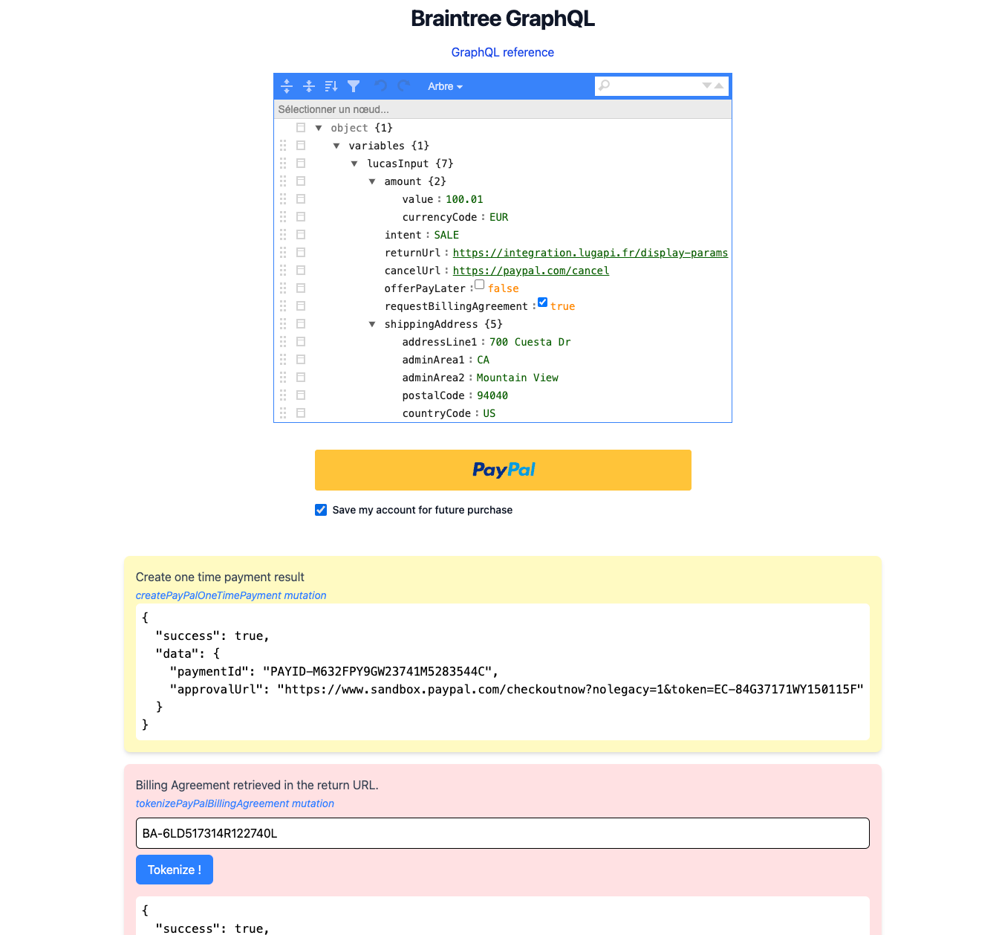
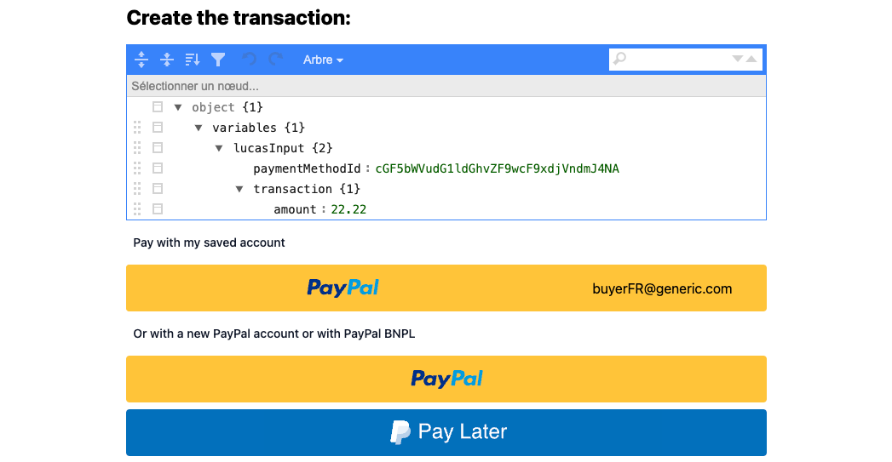

# Braintree GraphQL API: PayPal Vaulting Scenario

Welcome to the Braintree GraphQL API demonstration repository! This project aims to illustrate the PayPal vaulting scenario using Braintree's GraphQL APIs.

## Table of Contents

- [Introduction](#introduction)
- [Resources](#resources)
- [Features](#features)
- [Getting Started](#getting-started)
  - [Prerequisites](#prerequisites)
  - [Installation](#installation)
- [Usage](#usage)
- [Screenshots](#screenshots)

## Introduction

This repository provides a comprehensive example of how to use Braintree's GraphQL APIs to handle PayPal vaulting. Vaulting allows you to securely store payment information for future use, enhancing the checkout experience for returning customers.

## Resources

Braintree GraphQL documentation : [https://developer.paypal.com/braintree/graphql/reference](https://developer.paypal.com/braintree/graphql/reference)

## Features

- **PayPal Integration:** Seamlessly integrate PayPal as a payment method.
- **Vaulting:** Store customer payment information securely.
- **GraphQL API:** Utilize Braintree's GraphQL API for efficient and flexible data queries.
- **Example Scenarios:** Demonstrates common use cases for PayPal vaulting.

## Getting Started

### Prerequisites

Before you begin, ensure you have the following:

- A Braintree account with API credentials.
- Node.js and npm installed on your machine.
- Basic understanding of GraphQL and REST APIs.

### Installation

1. **Clone the repository:**

   ```bash
   git clone https://github.com/lugapi/Braintree_GraphQL_Node.git
   cd Braintree_GraphQL_Node
   ```

2. **Install dependencies:**

   ```bash
   npm install
   ```

3. **Set up environment variables:**

   ```bash
    BRAINTREE_MERCHANT_ID=your_merchant_id
    BRAINTREE_PUBLIC_KEY=your_public_key
    BRAINTREE_PRIVATE_KEY=your_private_key
   ```

### Usage

   ```bash
    npm start
   ```

- Access the Application: 

Open your web browser and navigate to http://localhost:3000 (or the port specified in your server configuration).
   
- Update JSON Data:
 
If needed, update the JSON configuration files with any specific data required for your testing scenario.

- Initiate PayPal Vaulting:

Click on the PayPal button and follow the on-screen instructions to complete the vaulting process. This will demonstrate how payment information is securely stored for future use.


### Screenshots

- First time :



- Returning :



